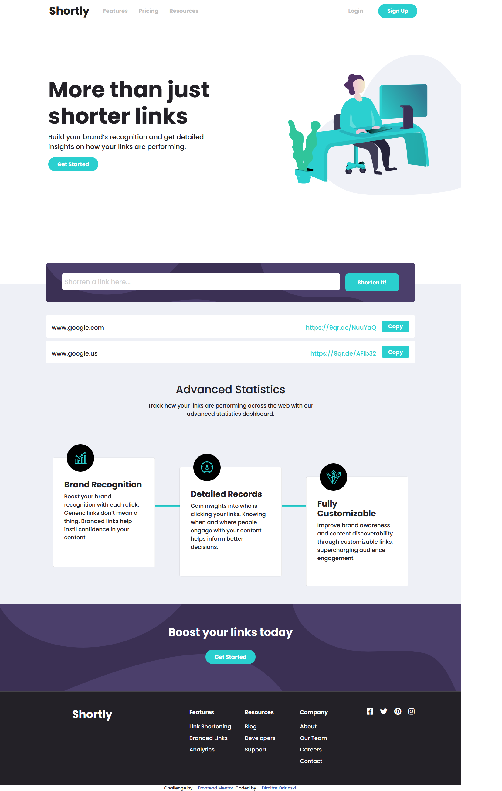
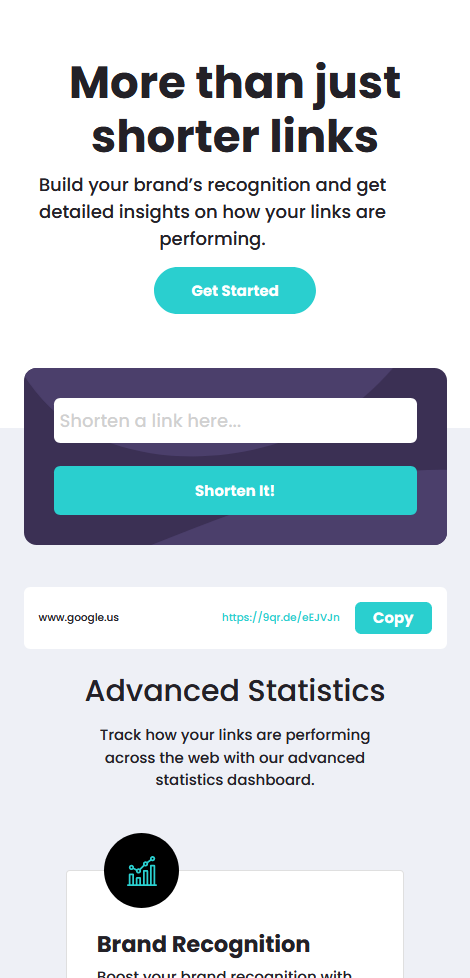

# Frontend Mentor - Shortly URL shortening API Challenge

## The challenge

Your challenge is to build out this landing page, integrate with the [shrtcode API](https://app.shrtco.de/) and get it looking as close to the design as possible.

You can use any tools you like to help you complete the challenge. So if you've got something you'd like to practice, feel free to give it a go.

Your users should be able to:

- View the optimal layout for the site depending on their device's screen size
- Shorten any valid URL
- See a list of their shortened links, even after refreshing the browser
- Copy the shortened link to their clipboard in a single click
- Receive an error message when the `form` is submitted if:
  - The `input` field is empty

### My Solution

"Shortly URL shortening API Challenge" project has been achieved by HTML5, CSS3 and Vanilla JS with Bootstrap for the menu.
Some functionalities has been added to the project:

- regex checking for a valid URL address;
- after error message appeared - it dissapears after 2 seconds;
- after button "shorten it" is pressed - the text in the "input" dissapears in 3 seconds;
- when button "copy" is pressed, the result bar dissapears in 5 seconds;

## Here are some previews of the final page

## Desktop view

Desktop view full page:

Desktop view with API results:

Desktop view with error message:

Desktop view with copied result:

Tablet view with API results:

Tablet view hero:

Tablet view - copied result:

## Mobile view

Mobile view navigation:

Mobile view API results and card:

Mobile view API results and title:

Mobile view with last card and footer:

Mobile view with error message:

## Challenge specification

The design has been created to the following widths:

- Mobile: 375px
- Desktop: 1440px
